<div align="center">
  <h1>🚖 NYC Taxi Data Engineering Platform</h1>
  <h3>End-to-End ELT Pipeline | Data Warehouse | BI & API Microservices</h3>

  <p>
    An enterprise-grade Data Engineering project transforming raw NYC Taxi data into actionable insights 
    via a modern stack: <strong>Airflow, dbt, PostgreSQL, FastAPI, and Power BI</strong>.
  </p>

  
  
  
  
  
  
</div>

<br>

## 📝 Table of Contents
1. [Project Overview](#overview)
2. [Architecture & Data Modeling](#architecture)
3. [Business Intelligence (Dashboards)](#bi)
4. [Orchestration (Airflow)](#airflow)
5. [Data Products (API)](#api)
6. [Observability & Alerting](#quality)
7. [Performance & Optimization](#perf)
8. [Installation](#install)

<hr>

<a name="overview"></a>
## 🔭 Project Overview

This project simulates a real-world data platform for a Taxi company. It ingests high-volume trip data, cleanses it, models it into a Star Schema, and serves it to different stakeholders (Executives, Operations, Finance) via Dashboards and APIs.

**Key Features:**
* **ELT Pipeline:** Ingestion of raw CSVs into Bronze/Silver/Gold layers using **dbt** and **Postgres**.
* **Data Quality:** Automated testing and "Revenue at Risk" calculation to detect anomalies (negative fares, time travel).
* **Microservice API:** A standalone **FastAPI** container serving Gold data to external apps.
* **Observability:** Slack alerting for data quality breaches.

<a name="architecture"></a>
## 🏗️ Architecture & Data Modeling

The project follows the Medallion Architecture (Bronze -> Silver -> Gold).

### The Star Schema (Gold Layer)
We transformed the data into a rigorous dimensional model optimized for BI performance.
<div align="center">
  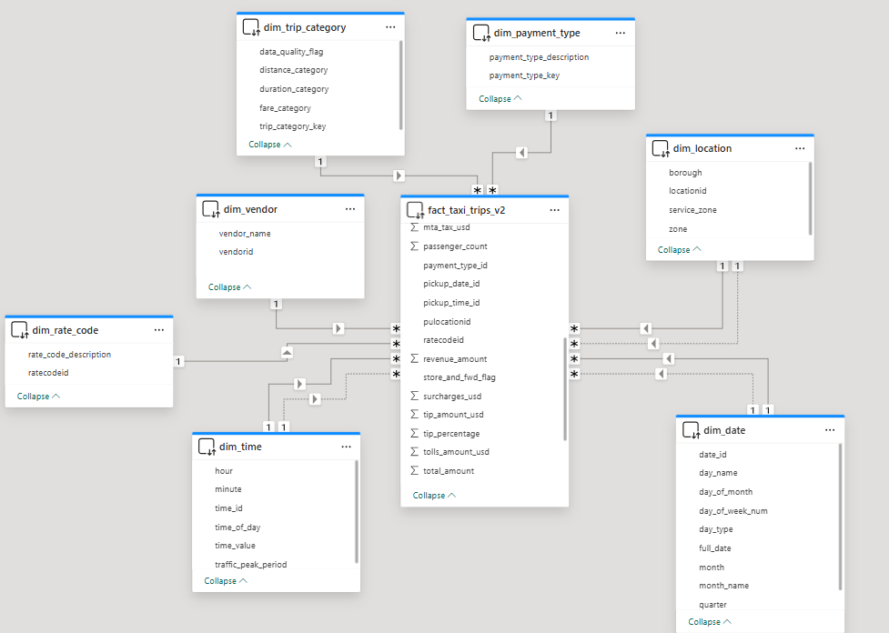
  <p><em>Entity Relationship Diagram (ERD) generated from the Gold Layer.</em></p>
</div>

### Aggregations for BI
To handle millions of rows efficiently in Power BI, specific Data Marts were created in dbt.
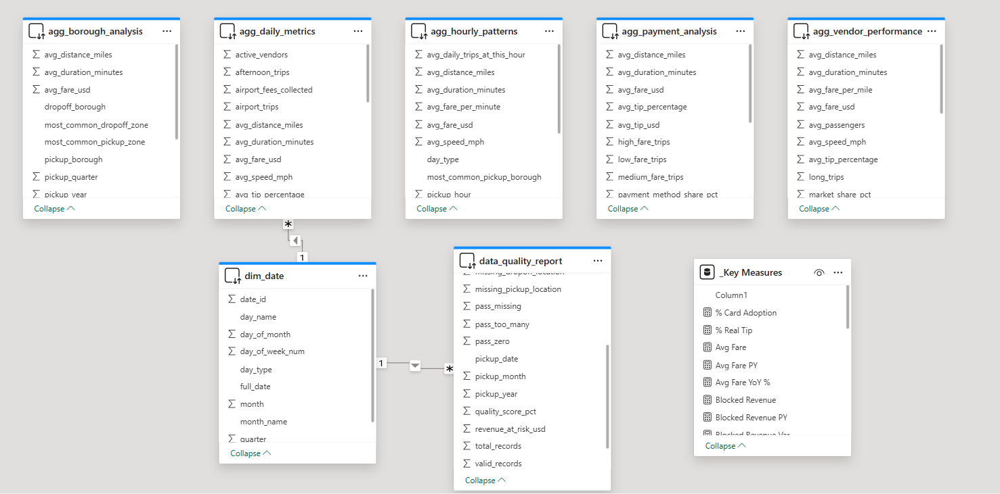

<a name="bi"></a>
## 📊 Business Intelligence (Power BI)

The final product is a comprehensive Power BI Report (`.pbip`) containing 4 specialized views.

### 1. Executive Pulse (C-Level)
*Focus: Year-over-Year growth, Total Revenue, and High-level trends.*
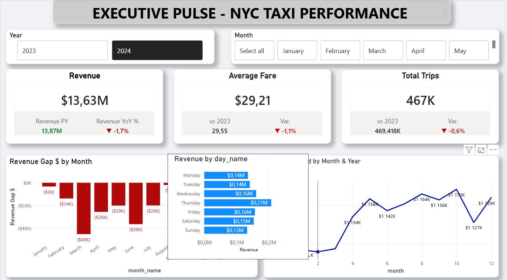

### 2. Operations & Traffic (Fleet Managers)
*Focus: Heatmaps, Borough-to-Borough flow, and RPM (Revenue Per Minute) optimization.*
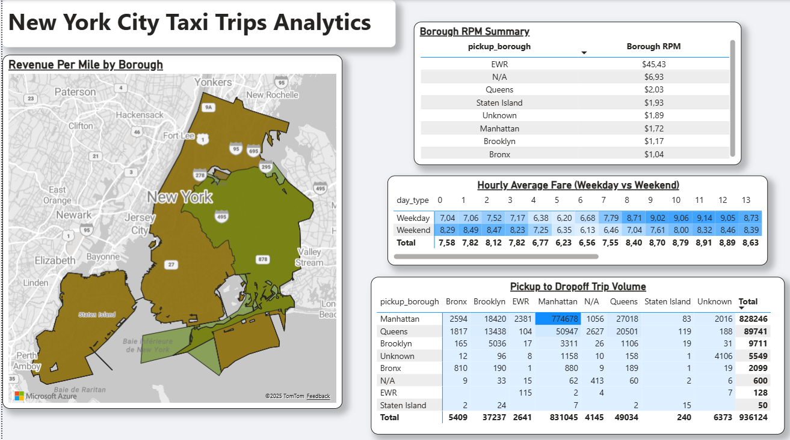

### 3. Financial Performance (Finance Dept)
*Focus: Payment methods adoption (Cash vs Card), Tipping behavior, and Fare buckets.*
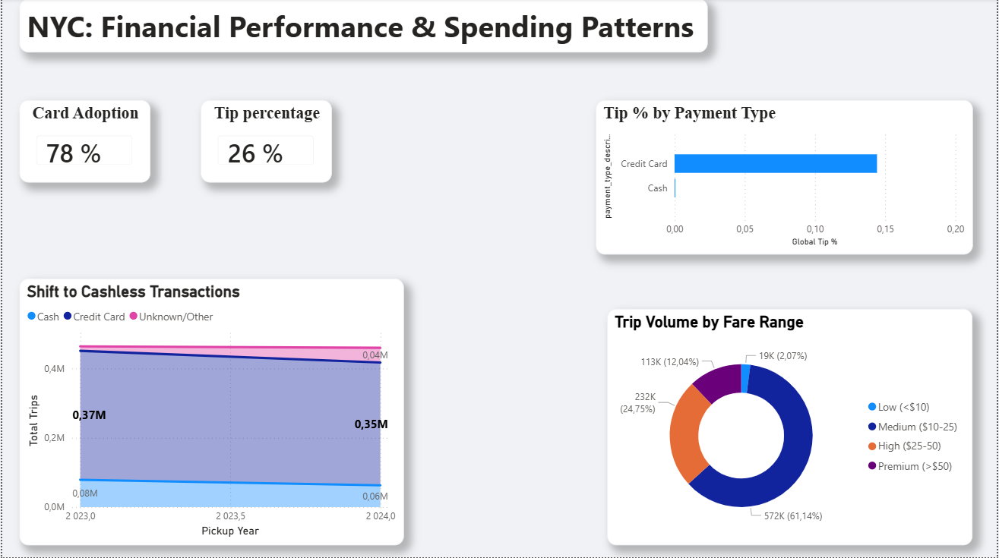

### 4. Data Quality Monitor (Data Engineering Team)
*Focus: Pipeline health, Invalid records tracking, and Revenue at Risk ($).*
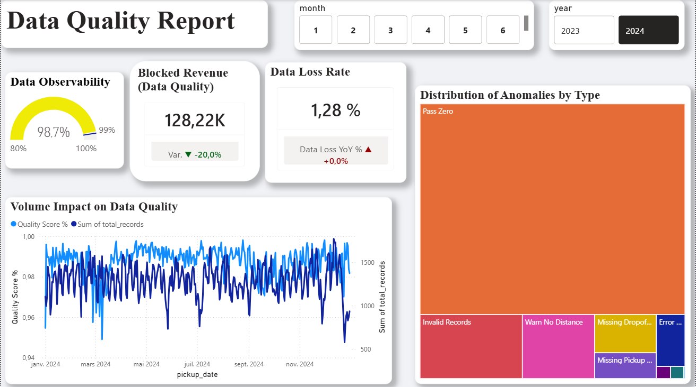

> **Feature Highlight:** Tooltips allow users to hover over data points for granular details.
> 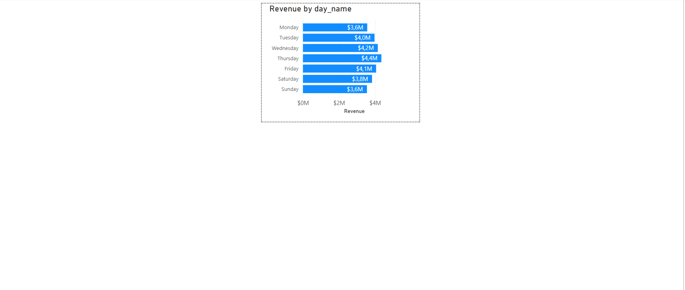

<a name="airflow"></a>
## 🌪️ Orchestration (Apache Airflow)

The entire pipeline is orchestrated via **Astro CLI** (Airflow).

### The Main Pipeline
Handles the end-to-end flow: `dbt run` (Silver/Gold), `dbt test`, and data freshness checks.
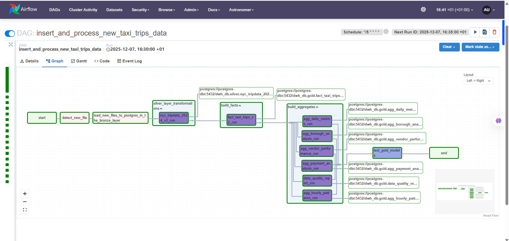

### Static Dimensions & Utility DAGs
Separate DAGs manage static data (Zones, Calendars) to optimize runtime.
<div align="center">
  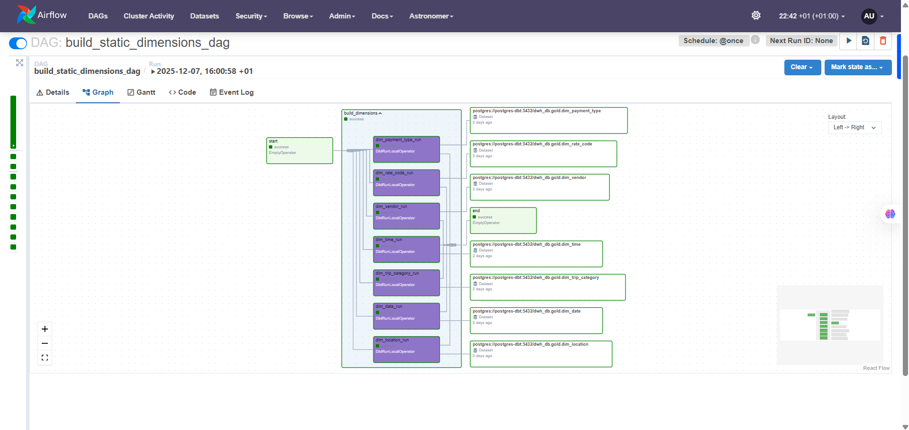
  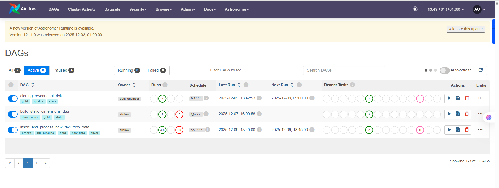
</div>

<a name="api"></a>
## 🚀 Data Products: FastAPI Microservice

Beyond dashboards, this project exposes a REST API for application developers.
The API runs in an isolated Docker container but communicates with the same Data Warehouse.

* **Endpoint:** `/metrics/daily` (Supports date filtering)
* **Architecture:** Dockerized FastAPI service networked with Postgres.

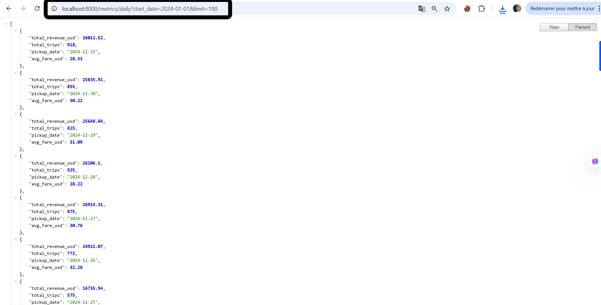

<a name="quality"></a>
## 🚨 Observability & Alerting

We implemented a **Reverse ETL** logic to proactively notify the team when Data Quality degrades.
If the **Revenue at Risk** exceeds a threshold (e.g., $10k), a Slack alert is triggered automatically.

<div align="center">
  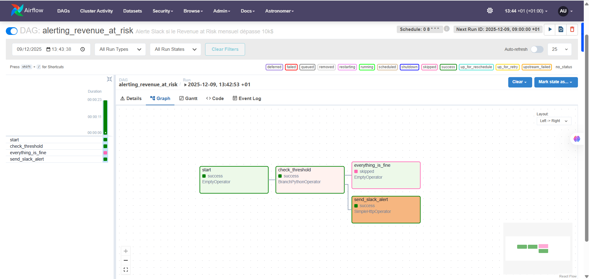
  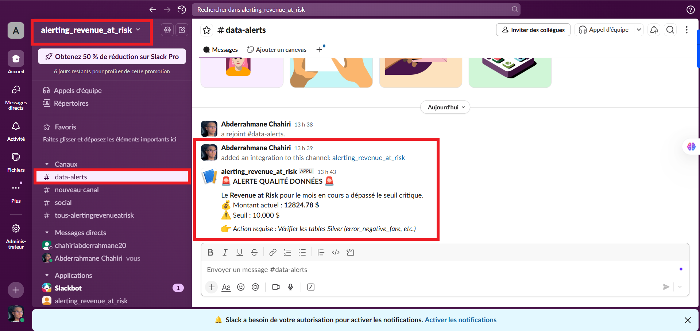
</div>

<a name="perf"></a>
## ⚡ Performance & Optimization

Optimization was a key part of the engineering process. By implementing incremental materialization and optimized joins in dbt:

| Before Optimization | After Optimization |
| :---: | :---: |
| 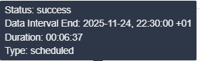 | 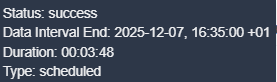 |
| *Long running times & full refreshes* | *Drastic reduction in execution time* |

<a name="install"></a>
## 💻 How to Run

### Prerequisites
* Docker & Docker Compose
* Astro CLI
* Power BI Desktop (to view `.pbit`)

### Steps

1. **Clone the repository**
   ```bash
   git clone [https://github.com/your-username/nyc-taxi-platform.git](https://github.com/your-username/nyc-taxi-platform.git)
   cd nyc-taxi-platform ````

2. **Start the Data Platform (Airflow + Postgres)** 
    ```bash
    astro dev start
    ```

3.  **Start the API Microservice**

    ```bash
    docker compose -f docker-compose-api.yml up --build
    ```

4.  **Access the Interfaces**

      * **Airflow:** `http://localhost:8080`
      * **FastAPI Docs:** `http://localhost:8000/docs`
      * **Power BI:** Open `assets/nyc_project_dashboard.pbit`


\<div align="center"\>
Made with ❤️ by \<a href="https://www.google.com/search?q=https://linkedin.com/in/ton-profil"\>Abderrahmane Chahiri\</a\>
\</div\>

